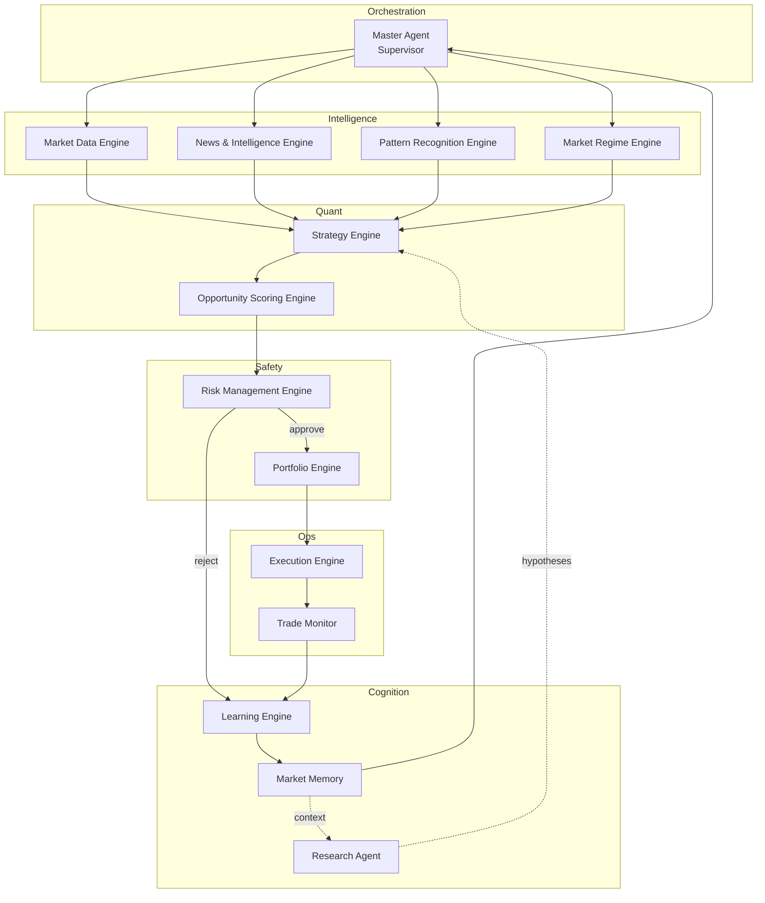

# Blueprint 2.0 — AI Quant Trading System (OgrowNT)

> Especificação técnica executável, derivada da Blueprint conceptual (v1).
> Objetivo: ser suficientemente concreta para um agente (Claude/Cursor) começar a
> construir o MVP sem decisões de arquitetura em aberto.

## 1. Visão

Sistema privado, single-tenant, de **pesquisa e trading quantitativo assistido por IA**,
operando 24/7, inicialmente em **paper trading**. O sistema observa múltiplos mercados,
gera hipóteses, testa-as estatisticamente, pontua oportunidades, e só executa quando o
**Risk Engine** aprova. Cada resultado retorna ao sistema como experiência (Learning
Engine + Market Memory).

**Objetivo central:** maximizar o retorno esperado ajustado ao risco, preservando capital
e evitando espirais de perda — nunca "ganhar dinheiro todos os dias".

## 2. Princípios inegociáveis (hard rules)

Estes princípios são implementados como **regras de código no Risk Engine**, não como
sugestões para o LLM seguir "com boa vontade":

1. `LLM ≠ Trading Engine` — nenhum modelo de linguagem decide sozinho uma entrada
   financeira. LLMs fazem pesquisa, interpretação de notícias, geração de hipóteses e
   explicações. Sizing, probabilidade, execução e risco são sempre motores
   determinísticos/estatísticos.
2. `Capital preservation > opportunity`
3. `Risk control > profit maximization`
4. `Statistical edge > intuition`
5. `Evidence > prediction`
6. `Adaptation > persistence`
7. `No trade > bad trade`
8. **Nunca perseguir prejuízo** — nenhuma regra de sizing pode aumentar risco em resposta
   direta a uma perda recente. Ver `08-risk-engine.md §Safety Belts`.
9. Toda decisão de trade tem de ser **auditável**: existe sempre um registo estruturado
   de "porquê" (score breakdown + risk checks), consultável na aba "Why?" do dashboard.

## 3. Arquitetura em alto nível

O ciclo operacional (loop 24/7) está detalhado em `05-event-flow.md`.

## 4. Stack tecnológico (decisão para o MVP)

| Camada | Escolha | Nota |
|---|---|---|
| Backend / agentes | Python 3.12 + FastAPI | ecossistema quant (pandas/polars, numpy, sklearn, torch) |
| Orquestração de agentes | processo próprio (asyncio) sobre event bus | evitar framework pesado no MVP |
| Frontend | Next.js (App Router) + TypeScript + Tailwind | dashboard single-user |
| Base de dados | PostgreSQL 16 + TimescaleDB (séries temporais) + pgvector (Market Memory) | um único Postgres cobre tudo no MVP |
| Cache / filas | Redis (Streams para event bus, pub/sub para live updates) | Kafka/Redpanda só se a escala justificar |
| Backtesting | motor próprio orientado a eventos (`packages/quant/backtest`) | ver `10-backtesting-paper-trading.md` |
| LLM | Claude (via API) para research/intelligence/explicações | nunca para sizing/execução |
| Broker/Exchange (paper) | adapter simulado + adapters reais (ex.: Alpaca, Binance, IBKR) atrás de uma interface comum | ver `03-api-spec.md §Execution Adapter` |
| Deploy | container único inicialmente (docker-compose); paper trading corre num worker sempre ativo | migrar para orquestração distribuída só na Fase 6+ |

## 5. Mapa de documentos desta Blueprint 2.0

| Documento | Conteúdo |
|---|---|
| `01-repo-structure.md` | Estrutura de pastas do monorepo |
| `02-database-schema.md` | Schema PostgreSQL completo (DDL) |
| `03-api-spec.md` | API REST + WebSocket do backend |
| `04-agents-architecture.md` | Os 12+4 módulos como agentes/serviços, contratos de entrada/saída |
| `05-event-flow.md` | Event bus, tópicos, payloads, sequência do loop 24/7 |
| `06-memory-system.md` | Market Memory (pgvector), Strategy/Pattern Memory |
| `07-scoring-engine.md` | Fórmula do Opportunity Score, pseudocódigo |
| `08-risk-engine.md` | Regras de risco, position sizing, Safety Belts, Kill Switch |
| `09-dashboard-spec.md` | Ecrãs, componentes, dados por ecrã |
| `10-backtesting-paper-trading.md` | Motor de backtest, walk-forward, anti-overfitting, paper trading |
| `11-prompts/` | Prompt mestre do Supervisor + prompts dos agentes LLM individuais |
| `12-roadmap.md` | Roadmap executável em 7 fases com critérios de aceitação |

## 6. Como usar esta Blueprint com Claude/Cursor

Cada documento é suficientemente autocontido para pedir a um agente de código:
"implementa `02-database-schema.md` como migrations Alembic" ou "implementa o
`Opportunity Scoring Engine` descrito em `07-scoring-engine.md` em
`packages/quant/scoring/`". A ordem recomendada de implementação segue
`12-roadmap.md`.
