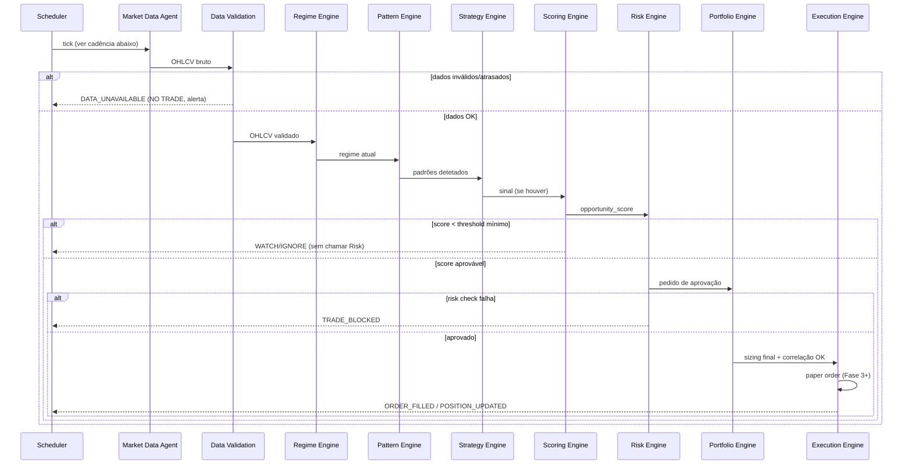

# 05 — Event Flow

## Event bus (MVP)

Redis Streams. Um stream por tópico, consumer groups por agente (permite replay e
"at-least-once" sem perder eventos se um agente reiniciar). Migração para
Kafka/Redpanda é uma troca de implementação do mesmo `EventBus` protocol — não afeta
os agentes.

```python
class EventBus(Protocol):
    async def publish(self, topic: str, event: BaseModel) -> None: ...
    async def subscribe(self, topic: str, group: str) -> AsyncIterator[BaseModel]: ...
```

## Tópicos

```text
MARKET_DATA_UPDATED
NEWS_RECEIVED
REGIME_CHANGED
PATTERN_DETECTED
SIGNAL_CREATED
OPPORTUNITY_CREATED
TRADE_APPROVED
TRADE_BLOCKED
ORDER_SUBMITTED
ORDER_FILLED
POSITION_UPDATED
TRADE_CLOSED
RISK_STATE_CHANGED
STRATEGY_DEGRADED
LEARNING_EVENT_CREATED
KILL_SWITCH_TRIGGERED
```

Cada payload é um modelo Pydantic definido em `packages/shared/events.py`, versão
mínima:

```python
class MarketDataUpdated(BaseModel):
    asset_id: int; timeframe: str; ts: datetime; data_quality: Literal["high","degraded","unavailable"]

class SignalCreated(BaseModel):
    signal_id: int; strategy_id: int; asset_id: int; direction: Literal["long","short"]

class OpportunityCreated(BaseModel):
    signal_id: int; final_score: float; tier: str

class TradeApproved(BaseModel):
    signal_id: int; approved_size: float; safety_belt_level: str

class TradeBlocked(BaseModel):
    signal_id: int; reason: str; failed_check: str

class RiskStateChanged(BaseModel):
    previous: str; current: str; reason: str

class KillSwitchTriggered(BaseModel):
    reason: str; triggered_by: Literal["auto","admin"]
```

## Loop 24/7 (Decision Pipeline)

O Master Supervisor executa este pipeline continuamente. **Qualquer falha numa etapa
crítica resulta em `NO TRADE`** para aquele sinal (não em skip silencioso — gera
`TRADE_BLOCKED` ou um alerta de dados em falta).



## Cadência (scheduler)

| Tarefa | Intervalo | Fase |
|---|---|---|
| Market scan | 1 min | 1 |
| Pattern analysis | 5 min | 4 |
| Strategy evaluation | 15 min | 2 |
| Portfolio analysis | 1 h | 3 |
| Strategy performance report | diário | 5 |
| Deep research report | semanal | 5 |

Todos os intervalos são configuráveis (`packages/shared/settings.py`), nunca
hardcoded no corpo dos agentes.

## Regra `NO TRADE`

`NO TRADE` é um resultado de primeira classe do pipeline, não uma exceção. É emitido
quando: dados indisponíveis/degradados; score abaixo do threshold; qualquer risk
check falha; `system_state.trading_enabled = false`; ou o Kill Switch está ativo. Em
todos os casos, o Master Supervisor regista o motivo em `audit_log` e segue o loop —
nunca tenta "forçar" uma alternativa.
